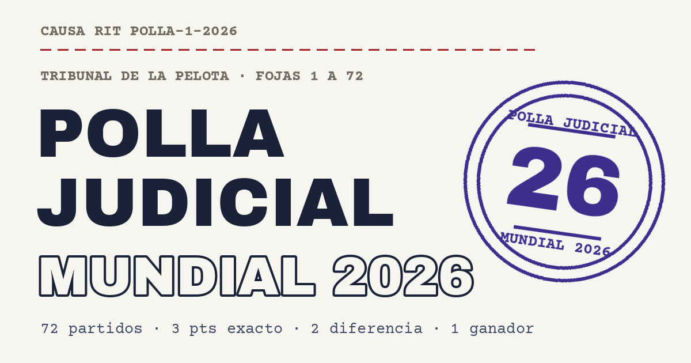

# ⚖️⚽ Polla Judicial · Mundial 2026



Polla entre amigos para la Copa del Mundo 2026, vestida de **expediente judicial chileno**: papel de acta, tipografía de máquina de escribir, fojas por grupo y un timbre que se estampa al firmar la predicción.

Los participantes **no necesitan cuenta de nada**: abren el link, se inscriben con nombre y apellido, predicen los 72 partidos de la fase de grupos y firman su acta. El administrador gestiona todo desde una **planilla de Google** (las predicciones llegan solas; él anota resultados y pagos), y la **tabla en vivo** se recalcula automáticamente.

## Reglas de la causa

La cuota es de **$10.000 CLP** (pagadera hasta la final, 19 de julio). El pozo se reparte por mitades: premio del campeón y fondo de la fiesta final. Puntaje por partido: **3** resultado exacto · **2** diferencia de gol · **1** solo el ganador. Cada partido se cierra a su hora de inicio, con validación también en el servidor.

## Características

Diseño a medida con fuentes auto-hospedadas y subseteadas (Archivo Black, Archivo y Courier Prime, ~75 KB en total), timbrazo SVG con texto curvo y textura de tinta real (`feTurbulence`), cuenta regresiva al próximo cierre y avisos "cierra en X h" por partido, barra flotante de cambios sin guardar, esqueletos de carga, tabla con medallas y pozo con conteo animado, actualización automática de la tabla cada 60 s, identidad recordada en el dispositivo, PWA instalable (manifest + íconos), accesibilidad (foco visible, `aria-live`, `prefers-reduced-motion`) y cero dependencias en producción: HTML + CSS + JavaScript moderno en módulos.

## Estructura

```
├── render.yaml               # Blueprint de Render (sitio estático)
├── apps-script/Code.gs       # API en Google Apps Script (la planilla es la base de datos)
├── public/                   # Sitio publicado
│   ├── index.html
│   ├── css/estilos.css       # Sistema de diseño "El Expediente del Mundial"
│   ├── js/
│   │   ├── config.js         # ← ÚNICO archivo que editas (URL del Apps Script)
│   │   ├── datos.js          # Selecciones y fixture oficial (72 partidos)
│   │   ├── util.js           # Formato, puntaje y cuentas regresivas
│   │   ├── api.js            # Cliente del Apps Script
│   │   ├── estado.js         # Estado de la aplicación
│   │   ├── ui.js             # Toasts, timbrazo SVG, pozo animado, savebar
│   │   ├── vistas.js         # Bases · Predicción · Tabla
│   │   └── app.js            # Render, eventos y temporizadores
│   ├── fonts/                # woff2 auto-hospedadas (subset latin, licencia OFL)
│   └── img/                  # Íconos PWA + imagen para compartir (og.png)
└── INSTRUCCIONES.md          # Puesta en marcha paso a paso (~15 min)
```

## Puesta en marcha rápida

1. **Planilla + API:** crea una hoja en Google Sheets, pega `apps-script/Code.gs` en *Extensiones → Apps Script*, ejecuta `configurar` una vez y publica como *Aplicación web* (acceso: cualquier persona). Copia la URL `/exec`.
2. **Conectar:** pega esa URL en `public/js/config.js` (`API_URL`).
3. **Desplegar:** sube este repo a GitHub y en Render usa **New + → Blueprint** apuntando al repo (el `render.yaml` configura todo). Cada `git push` redespliega solo.

El detalle completo, con capturas de a dónde hacer clic, está en [INSTRUCCIONES.md](INSTRUCCIONES.md).

## Desarrollo local

```bash
npx serve public        # o cualquier servidor estático
node scripts/smoke.mjs  # pruebas de puntaje y vistas
```

## Créditos

Fixture oficial FIFA 2026 (fase de grupos). Tipografías [Archivo](https://fonts.google.com/specimen/Archivo), [Archivo Black](https://fonts.google.com/specimen/Archivo+Black) y [Courier Prime](https://fonts.google.com/specimen/Courier+Prime), licencia SIL OFL. Código bajo licencia MIT.
